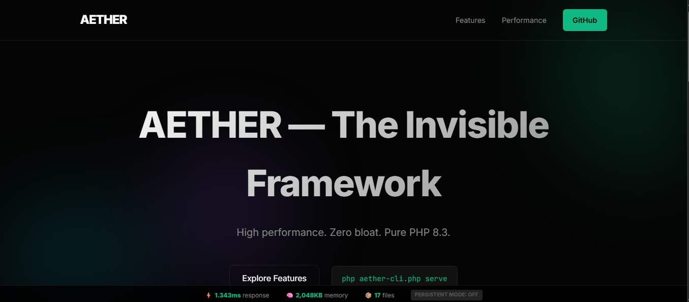

# AETHER Demo Site

This is a showcase website built with the **AETHER Framework**. 



## Features
- **Modern Design**: Built with glassmorphism and premium aesthetics.
- **AETHER Powered**: Uses the lightweight, high-performance AETHER core.
- **Zero Dependencies**: Pure PHP 8.3. No Composer. No bloat.

## Getting Started

### 1. Requirements
- PHP 8.3 or later.
- A brain.

### 2. Run Locally
You can use the built-in PHP server for development:

```bash
php -S localhost:8080 -t public
```

Or use the AETHER worker manager for production-grade performance:

```bash
php aether-cli.php serve
```

## Structure
- `aether/`: The framework core.
- `app/`: Your application logic (Controllers, Views).
- `public/`: Publicly accessible assets.
- `aether.php`: Bootstrap loader.

## License
MIT.
